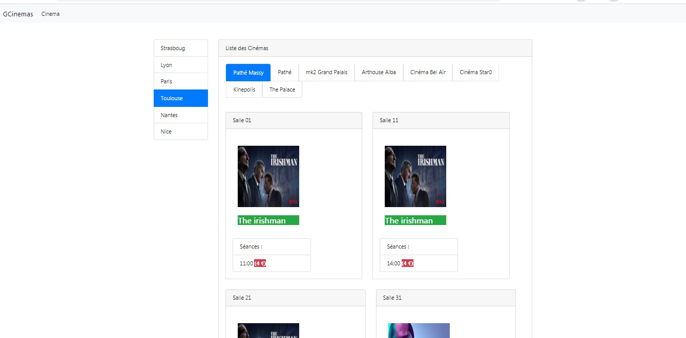
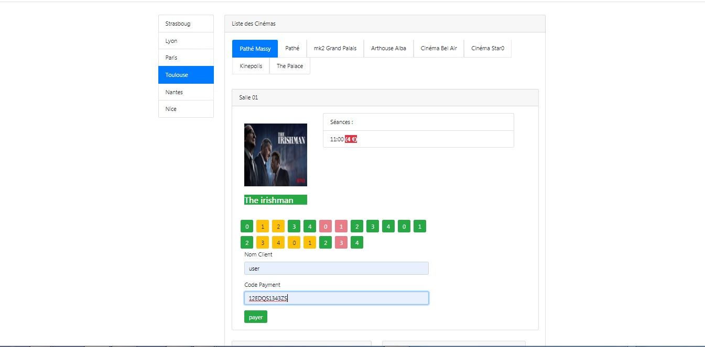

## TITRE
Cinemas Management Web Application

## SCREENSHOTS

 
     
    <b>The main interface</b>
      
      
    <b>The reservation of tickets</b>
 

 

## DESCRIPTION

This project consists of developing a J2EE  web application that allows viewers to book movies ticket using simple and Interactive GUI.  The system is so simple and attractive which will make the audiences/viewers comfortable to use and choose their movie along with desired seat number and position.
this project contains a back-end part and a front-end part.

## FRONTEND
The frontend source code :
 
https://github.com/aniskchaou/PROJET_GESTION_DES_CINEMAS_ANGULAR_FRONT_END

## TECHNOLOGIES

Java, Springboot, JPA, Hibernate, MySQL 