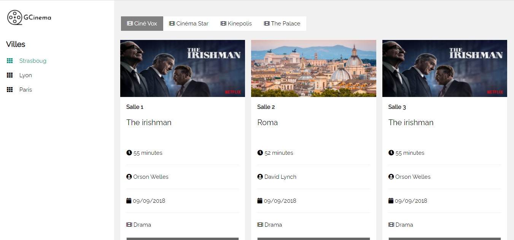

## Introduction

Business Route is a showcase web site is a website used to present the products and services offered by a company or small business to the customer, reinforcing the perception of the brand.

## Informations

 - Status: under development
-   Latest version 1.0
-   Sector : Audiovisual
-   Created: May 2020
-   Last updated: May 2020

## Table of contents
* [Documentation](#general-info)
* [Demo](#demo)
* [Screenshots](#screenshots)
* [Technologies](#technologies)
* [Setup](#setup)
* [Features](#features)
* [Status](#status)
* [Contact](#contact)
* [License](#license)

## Documentation
https://github.com/aniskchaou/GCINEMAS_BACKEND/wiki/

## Demo
[http://businessplus.byethost32.com/ ](http://businessplus.byethost32.com/)

## Screenshots

## Technologies
* Angular
* Spring boot
* Node.js

## Setup

## Features
* Manage the films displayed for each room
* Manage bookings

## Contact
contact@delta-dev-software.com

## License
<a href="license.txt">MIT License</a>
